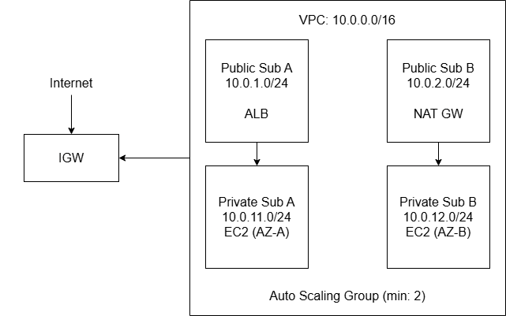

# aws-week2-vpc-alb-ha
An available, secure web tier on AWS built with a custom VPC, Application Load Balancer, and Auto Scaling Group across two Availability Zones.

---

## Objective

The goal of this project is to design and deploy a production-style web architecture on AWS that demonstrates:

- **Network isolation** using public and private subnets
- **High availability** by spreading workloads across multiple Availability Zones
- **Auto-healing** infrastructure using Auto Scaling Groups
- **Least-privilege security** using Security Group referencing

This was completed as part of Week 2 of a structured AWS learning program.

---

## Architecture Diagram


---

## Components

| Resource | Name | Purpose |
|---|---|---|
| VPC | `week2-vpc-project` | Isolated network (10.0.0.0/16) |
| Public Subnet A | `10.0.1.0/24` | ALB node in AZ-A |
| Public Subnet B | `10.0.2.0/24` | ALB node in AZ-B |
| Private Subnet A | `10.0.11.0/24` | EC2 instances in AZ-A |
| Private Subnet B | `10.0.12.0/24` | EC2 instances in AZ-B |
| Internet Gateway | `week2-igw` | Public internet entry point |
| NAT Gateway | `week2-nat` | Outbound internet for private instances |
| Security Group (ALB) | `week2-sg-alb` | Allows HTTP 80 from internet |
| Security Group (EC2) | `week2-sg-web` | Allows HTTP 80 from ALB SG only |
| Launch Template | `week2-launch-template` | EC2 config + nginx bootstrap |
| Target Group | `week2-tg` | Pool of healthy EC2 instances |
| Application Load Balancer | `week2-alb` | Distributes traffic across AZs |
| Auto Scaling Group | `week2-asg` | Maintains 2 instances, replaces failures |

---

## Security Model

### Security Group Rules

**ALB Security Group (`week2-sg-alb`)**
| Direction | Protocol | Port | Source |
|---|---|---|---|
| Inbound | HTTP | 80 | 0.0.0.0/0 (internet) |
| Outbound | All | All | 0.0.0.0/0 |

**EC2 Security Group (`week2-sg-web`)**
| Direction | Protocol | Port | Source |
|---|---|---|---|
| Inbound | HTTP | 80 | `week2-sg-alb` only |
| Outbound | All | All | 0.0.0.0/0 |

### Design Principles

- EC2 instances live in **private subnets** — not reachable from the internet directly
- Only the ALB can send traffic to instances (SG references SG, not IP ranges)
- Instances reach the internet for updates via **NAT Gateway** (outbound only)
- No SSH open to the internet — bastion host or SSM would be used for access in production

---

## HA Test Evidence

### Test: Instance Termination + Auto Recovery

**Step 1 — Terminated instance `i-0abc123def456` in AZ-A**

ASG Activity log showed:
```
Terminating EC2 instance: i-0abc123def456  [AZ: ca-central-1a]
Launching a new EC2 instance to maintain desired capacity
Successfully launched: i-0xyz789ghi012   [AZ: ca-central-1a]
```

**Step 2 — ALB continued serving traffic throughout**

The browser was refreshed continuously during the replacement. The page remained available with no errors. Once the new instance passed health checks, it began receiving traffic.

**Result:** Zero downtime. Service remained available during instance failure and replacement.

### Screenshots

| Screenshot | Description |
|---|---|
| `screenshots/vpc-subnets.png` | VPC subnet list with public/private labels |
| `screenshots/route-tables.png` | Public route table (IGW) vs private (NAT) |
| `screenshots/alb-listeners.png` | ALB listener forwarding HTTP:80 to target group |
| `screenshots/healthy-targets.png` | Both targets showing "healthy" status |
| `screenshots/asg-activity.png` | ASG activity log during termination + replacement |
| `screenshots/browser-az-a.png` | Browser showing Instance ID from AZ-A |
| `screenshots/browser-az-b.png` | Browser showing Instance ID from AZ-B |

---

## Costs & Teardown

### Estimated Costs (if left running 24 hrs)

| Resource | Approx. Cost |
|---|---|
| NAT Gateway | ~$0.045/hr + data transfer |
| ALB | ~$0.008/hr + LCU charges |
| 2x t3.micro EC2 | ~$0.021/hr total |
| **Total (24 hrs)** | **~$2–4** |

> ⚠️ NAT Gateway is the biggest cost driver. Always delete it when not actively using the environment.

### Teardown Order

Delete resources in this exact order to avoid dependency errors:

```
1. Delete Auto Scaling Group       → terminates EC2 instances automatically
2. Delete Application Load Balancer
3. Delete Target Group
4. Delete NAT Gateway              ← critical for cost
5. Release Elastic IP              ← NAT Gateway allocates one
6. Delete Subnets
7. Delete Route Tables
8. Detach + Delete Internet Gateway
9. Delete VPC
10. Delete S3 log bucket (if created)
```

---

## Troubleshooting Guide

**Problem: ALB DNS shows 502 Bad Gateway**
- Check Target Group → Targets tab — are instances "healthy"?
- Instances may still be booting. Wait 2–3 minutes for user data script to finish.
- Verify the EC2 security group allows port 80 from the ALB security group.

**Problem: Target group shows instances as "unhealthy"**
- SSH into an instance (via bastion or SSM) and run `curl localhost` — is nginx responding?
- Check that the health check path is `/` and nginx is serving on port 80.
- Confirm the instance security group inbound rule references the ALB SG, not an IP.

**Problem: ASG not launching instances into private subnets**
- Confirm the ASG subnet config points to the private subnets, not public ones.
- Check that private subnets have a route to the NAT Gateway.

**Problem: NAT Gateway not providing internet access to private instances**
- Verify the private route table has `0.0.0.0/0 → NAT Gateway`.
- Confirm the NAT Gateway is in a **public** subnet (common mistake: placing it in private).
- Check the NAT Gateway status is "Available" (not "Pending").

---

## Key Concepts Learned

- **Public vs Private subnets** — Public subnets route to an IGW; private subnets use NAT for outbound only
- **IGW vs NAT Gateway** — IGW is bidirectional; NAT is outbound-only for private resources
- **ALB vs Target Group vs Listener** — ALB is the entry point; listener is the rule; target group is the destination
- **ELB health checks vs EC2 status checks** — ELB checks application-level health; ASG uses this to replace broken instances
- **SG referencing SG** — More secure and dynamic than IP allowlists; works even as instances are replaced

---

## Region

`ca-central-1` (Canada)
